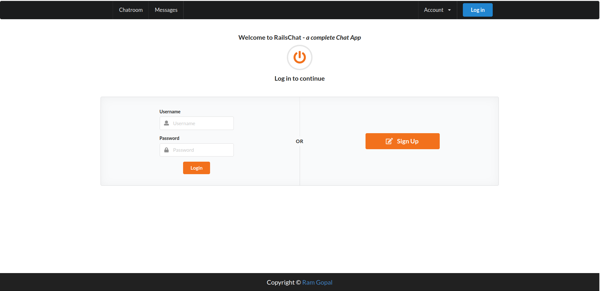
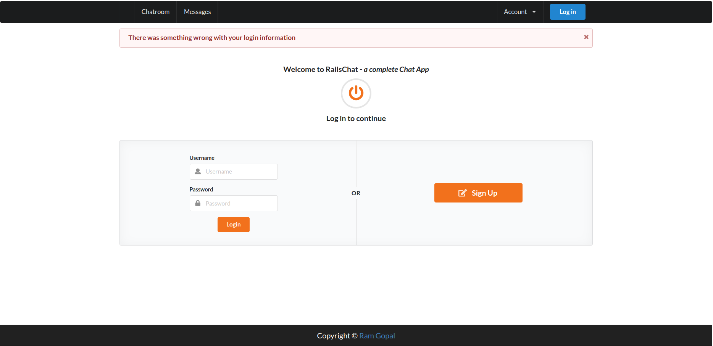
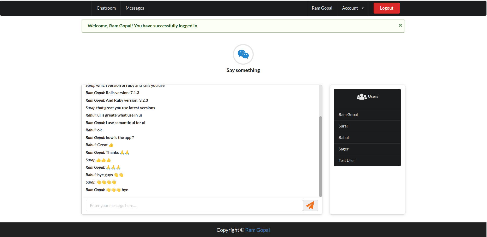
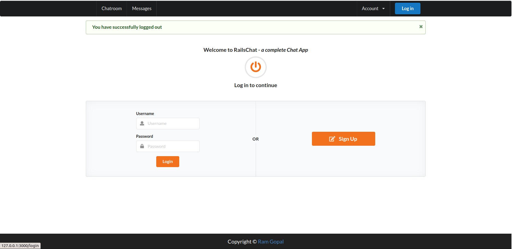

# RailsChat 

- Real time message app useing Action Cable & Web Sockets
- This app can add multiple user and they can send message in chatroom
- Update message in all user's chatroom real time without refresh page
- Use Sementic-UI for User Interface(frontend)

---

#### This Project is part of [Udemy Course "The Complete Ruby on Rails Developer Course" ](https://www.udemy.com/course/the-complete-ruby-on-rails-developer-course/)

---

#### For more info OR suggestion contact me on

- ### My Twitter :- <a href="https://twitter.com/ramgopalsiddh1/" target="_blank"> Twitter/ramgopal </a>

- ### Portfolio :- <a href="https://ramgopal.dev/" target="_blank">ramgopal.dev</a>
---

## Screenshots

#### Home
  

#### Login with wrong credentials
  

#### Successfully login with correct credentials
  

#### Logout from Rails chat
  

# README

This README would normally document whatever steps are necessary to get the
application up and running.

Things you may want to cover:

* Rails version: 7.1.3

* Ruby version: ruby 3.2.3 (2024-01-18 revision 52bb2ac0a6) [x86_64-linux]

* System dependencies

* Configuration

* Database creation

* Database initialization

* How to run the test suite

* Services (job queues, cache servers, search engines, etc.)

* Deployment instructions

* ### setup Sementic-ui
- [I follow this article for setup Sementic-ui](https://medium.com/@justicea83/adding-jquery-and-semantic-ui-to-a-rails-7-project-2a7469d4c95c)
